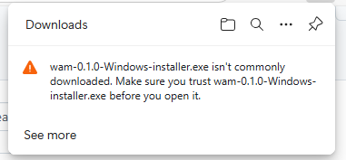
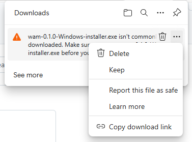
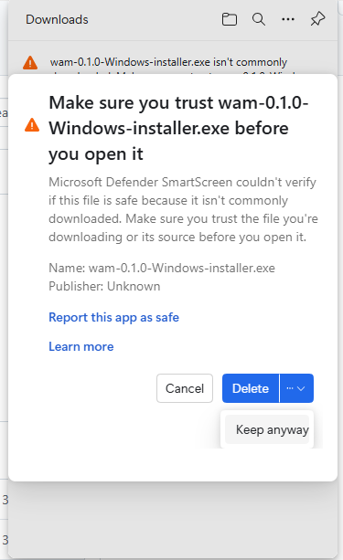
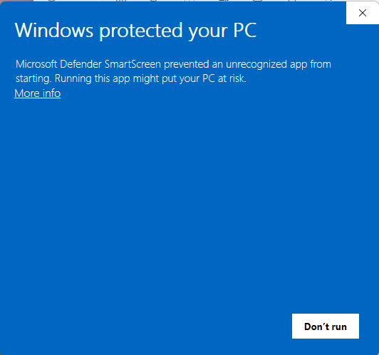
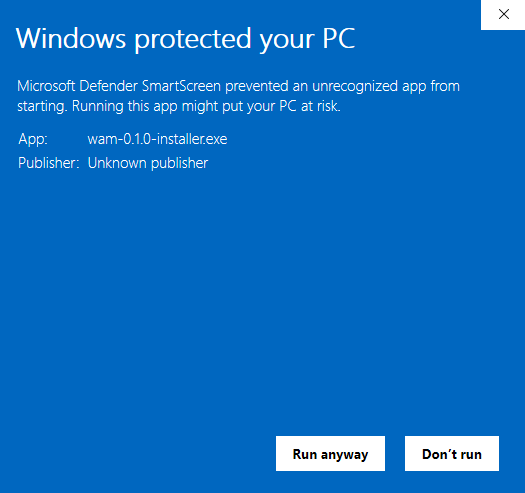

The Web Archive Manager (WAM) is part of the toolkit to aid researchers in working
with web archives. Our aim is to enable usage of archives as a research data source.

Below are what you can do in WAM:

- [Organise and manage web archives](#organise-and-manage-web-archives)
- [Replay web archives](#replay-web-archives)
- [Annotate archived web content](#annotate-archived-web-content)

WAM is developed by [QUT Digital Observatory](https://www.digitalobservatory.net.au/),
as part of the [Australian Internet Observatory (AIO)](https://internetobservatory.org.au/).
AIO received co-investment ([doi.org/10.3565/hjrp-b141](https://doi.org/10.3565/hjrp-b141))
from the Australian Research Data Commons (ARDC) through the [HASS and Indigenous Research Data Commons](https://ardc.edu.au/hass-and-indigenous-research-data-commons/).
The ARDC is enabled by the National Collaborative Research Infrastructure Strategy (NCRIS).

Please share your feedback via this [feedback form](https://bit.ly/wam-feedback) or by emailing us at <digitalobservatory@qut.edu.au>.

::: {layout-ncol=2 layout-valign="center"}

{width=200 fig-align="center"}

{width=200 fig-align="center"}

:::


## Installation

WAM is currently available in Windows only. Click on the link below to download the installer.

::: {.panel-tabset}

## Windows

You can install WAM on Windows via the installer, or by running the executable.

[WAM (Web Archive Manager)-0.1.0](https://github.com/QUT-Digital-Observatory/wam-docs/releases)

### Troubleshooting

WAM is a perfectly safe piece of software and poses no security risks to any device.
However, you might get warnings over the download and installation of the program.
Below are some possible cases and how you can resolve them.

#### 1. Download warning in Microsoft Edge

It is recommended that you download the installer with a Chrome-based browser.
However, if you download the file in Microsoft Edge, you might get a warning message over the download (see screenshots below).
Click on the 3-dot icon and select **Keep**, then select **Keep anyway**.
That should allow you to download and access the file.

::: {layout-ncol=3}







:::

#### 2. Installation warning when running the Windows installer

When running the Windows installer, you might get a warning about the app being "unrecognizeable" (see screenshot below).
You can bypass the warning by clicking **More info** and then click **Run anyway**.

::: {layout-ncol=2}





:::

## macOS (ARM)

[WAM (Web Archive Manager)-0.1.0](https://github.com/QUT-Digital-Observatory/wam-docs/releases)

If you are installing WAM for the first time, you might have to allow WAM to be run on your Mac.

1. Install WAM from the disk image file by dragging the app to the Applications directory
2. Open Terminal (you can find this in the Finder under Applications > Utilities)
3. In your Terminal, run the following line:

   ```bash
   xattr -d com.apple.quarantine /Applications/wam.app
   ```

4. Restart WAM

## Linux (Debian)

[WAM (Web Archive Manager)-0.1.0](https://github.com/QUT-Digital-Observatory/wam-docs/releases)

:::

## Features

### Organise and manage web archives

A WAM **project** allows you to store related archives in one dedicated space.
The project can be exported as a research artifact, e.g. RO Crate, to be shared with other researchers.
You can also add your own custom metadata to archive files.


### Replay web archives

In WAM, you can replay the pages you've archived.


### Annotate archived web content

When replaying an archived page, you can **annotate** the entire page or specific sections within the page by
adding custom annotations. In other words, annotation enables qualitative coding of archived web content.


## Getting started

::: {.box-info}

### Naming conventions for metadata titles

Metadata titles are case sensitive, meaning `metadataTitle` and `metadatatitle` will be taken as two different words.

No spaces or special characters are allowed. The only special character you can use is @.

Standard metadata such as file, timestamp, size, and tags are reserved, so if you try to add a metadata title using these words, they will be ignored.

**Examples of acceptable metadata titles**: authorName, authorname, @authorName.
:::

## Feedback

WAM is still in its early stage of development and prototyping.
Therefore, we value all kinds of user feedback which will help inform future improvements to the software.
Please leave your comments via [https://bit.ly/wam-feedback](https://bit.ly/wam-feedback).